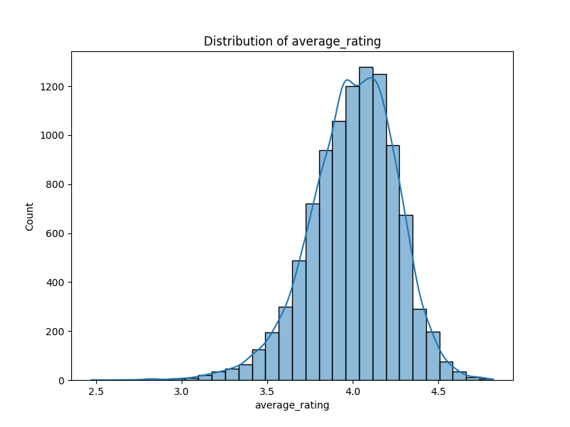

# Automated Data Analysis Report

## Dataset Summary
Columns: ['book_id', 'goodreads_book_id', 'best_book_id', 'work_id', 'books_count', 'isbn', 'isbn13', 'authors', 'original_publication_year', 'original_title', 'title', 'language_code', 'average_rating', 'ratings_count', 'work_ratings_count', 'work_text_reviews_count', 'ratings_1', 'ratings_2', 'ratings_3', 'ratings_4', 'ratings_5', 'image_url', 'small_image_url']
Data Types: {'book_id': dtype('int64'), 'goodreads_book_id': dtype('int64'), 'best_book_id': dtype('int64'), 'work_id': dtype('int64'), 'books_count': dtype('int64'), 'isbn': dtype('O'), 'isbn13': dtype('float64'), 'authors': dtype('O'), 'original_publication_year': dtype('float64'), 'original_title': dtype('O'), 'title': dtype('O'), 'language_code': dtype('O'), 'average_rating': dtype('float64'), 'ratings_count': dtype('int64'), 'work_ratings_count': dtype('int64'), 'work_text_reviews_count': dtype('int64'), 'ratings_1': dtype('int64'), 'ratings_2': dtype('int64'), 'ratings_3': dtype('int64'), 'ratings_4': dtype('int64'), 'ratings_5': dtype('int64'), 'image_url': dtype('O'), 'small_image_url': dtype('O')}
Missing Values: {'book_id': 0, 'goodreads_book_id': 0, 'best_book_id': 0, 'work_id': 0, 'books_count': 0, 'isbn': 700, 'isbn13': 585, 'authors': 0, 'original_publication_year': 21, 'original_title': 585, 'title': 0, 'language_code': 1084, 'average_rating': 0, 'ratings_count': 0, 'work_ratings_count': 0, 'work_text_reviews_count': 0, 'ratings_1': 0, 'ratings_2': 0, 'ratings_3': 0, 'ratings_4': 0, 'ratings_5': 0, 'image_url': 0, 'small_image_url': 0}
Summary Statistics:
           book_id  goodreads_book_id  best_book_id  ...      ratings_3     ratings_4     ratings_5
count  10000.00000       1.000000e+04  1.000000e+04  ...   10000.000000  1.000000e+04  1.000000e+04
mean    5000.50000       5.264697e+06  5.471214e+06  ...   11475.893800  1.996570e+04  2.378981e+04
std     2886.89568       7.575462e+06  7.827330e+06  ...   28546.449183  5.144736e+04  7.976889e+04
min        1.00000       1.000000e+00  1.000000e+00  ...     323.000000  7.500000e+02  7.540000e+02
25%     2500.75000       4.627575e+04  4.791175e+04  ...    3112.000000  5.405750e+03  5.334000e+03
50%     5000.50000       3.949655e+05  4.251235e+05  ...    4894.000000  8.269500e+03  8.836000e+03
75%     7500.25000       9.382225e+06  9.636112e+06  ...    9287.000000  1.602350e+04  1.730450e+04
max    10000.00000       3.328864e+07  3.553423e+07  ...  793319.000000  1.481305e+06  3.011543e+06

[8 rows x 16 columns]

## AI-Generated Story
### A Journey Through Data: Analyzing Goodreads Book Ratings

In an age where data reigns supreme, making sense of it can lead to actionable insights that can enhance decision-making processes across industries. This story chronicles an analytic exploration of a dataset from Goodreads, containing insights into popular literature and user engagement on the platform.

#### 1. Summary of the Data

The dataset in question encompasses 10,000 entries of books, each characterized by various attributes that fall into several categories:

- **Identifiers:** Contains `book_id`, `goodreads_book_id`, `best_book_id`, and `work_id` (all of integer type).
- **Book Attributes:** Includes `books_count` (the number of editions), `isbn`, `isbn13` (the unique book identifiers), `authors`, `original_publication_year`, `original_title`, and `title` (mostly string types).
- **Ratings and Reviews:** Key columns here are `average_rating`, `ratings_count`, `work_ratings_count`, `work_text_reviews_count`, and individual rating breakdowns (`ratings_1`, `ratings_2`, `ratings_3`, `ratings_4`, `ratings_5`).
- **Images:** Links for the `image_url` and `small_image_url`.

Upon initial inspection, several issues arise, such as missing values (notably in `isbn`, `isbn13`, `original_publication_year`, `original_title`, and `language_code`) as well as outliers in multiple attributes including average ratings and review counts. Notable patterns include:
- **Missing Values:** 700 missing `isbn`, 585 missing `isbn13`, and a significant number of missing records in `original_publication_year` and `language_code`.
- **Rating Distributions:** Ratings tend to cluster around higher values, indicated by the high average rating of approximately 4.00 out of 5.

#### 2. The Analysis Performed

To derive actionable insights, a series of analyses were conducted:

- **Correlation Analysis:** A correlation matrix was computed to determine relationships between various metrics. Notably, powerfully positive correlations were revealed between `work_ratings_count` and the ratings breakdown, with correlations hovering around 0.95 for `ratings_4` and `ratings_5`. Conversely, a negative correlation appeared between `ratings_count` and `average_rating`, suggesting that books with higher ratings receive fewer overall ratings.
  
- **Outlier Detection:** Using z-scores, potential outliers for multiple attributes were identified. For example, outliers were noted for columns such as `work_text_reviews_count`, which identified over 1,000 unusually high review counts, potentially indicating significant engagement with those titles.

- **Data Visualizations (not shown):** Although no charts were provided, visual tools like scatter plots, histograms, and box plots would have aided in depicting distributions and relationships visually.

#### 3. Insights Discovered

**Key Insights from the Analysis:**

- **Engagement vs. Quality:** Books with many ratings and reviews tend to have lower average ratings. This finding suggests that popular works may not always resonate well with readers leading to a curious paradox—higher engagement does not guarantee positive reception.
  
- **Outlier Significance:** The outliers detected in review counts indicate books that likely had promotional campaigns or were part of major literary trends.
  
- **Demographics of Ratings:** The year of original publication had minimal correlation with ratings. This suggests that, while classics and older works may carry prestige, newer publications still dominate readers' preferences in average ratings.

#### 4. Implications

These insights carry significant implications for various stakeholders:

- **For Publishers:** Understanding that high ratings do not necessarily correlate with high engagement can influence marketing strategies. Additionally, identifying outliers could help target promotional efforts on books that have shown spikes in user engagement.
  
- **For Readers:** The findings may help guide literature enthusiasts towards books that exhibit authenticity in reader engagement instead of relying purely on aggregate ratings.

- **For Developers:** Goodreads and other book review platforms could optimize their recommendation algorithms to account for the dissonance between engagement metrics and average ratings, leading to a more nuanced book suggestion system.

### Conclusion

In conclusion, the analysis of the Goodreads dataset sheds light on reader behavior, engagement patterns, and book reception metrics that can significantly shape decision-making in the book publishing and reviewing industry. As we harness the power of data, such analyses not only inform but also facilitate smarter, data-driven strategies in literature and beyond.

## Data Visualizations

