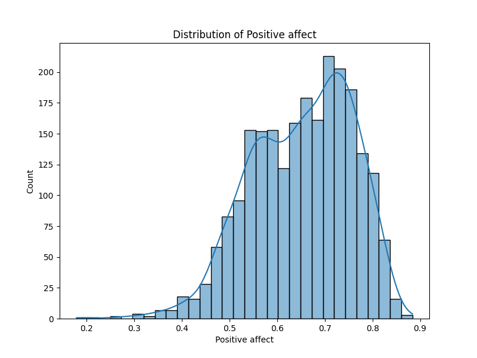

# Automated Data Analysis Report

## Dataset Summary
Columns: ['Country name', 'year', 'Life Ladder', 'Log GDP per capita', 'Social support', 'Healthy life expectancy at birth', 'Freedom to make life choices', 'Generosity', 'Perceptions of corruption', 'Positive affect', 'Negative affect']
Data Types: {'Country name': dtype('O'), 'year': dtype('int64'), 'Life Ladder': dtype('float64'), 'Log GDP per capita': dtype('float64'), 'Social support': dtype('float64'), 'Healthy life expectancy at birth': dtype('float64'), 'Freedom to make life choices': dtype('float64'), 'Generosity': dtype('float64'), 'Perceptions of corruption': dtype('float64'), 'Positive affect': dtype('float64'), 'Negative affect': dtype('float64')}
Missing Values: {'Country name': 0, 'year': 0, 'Life Ladder': 0, 'Log GDP per capita': 28, 'Social support': 13, 'Healthy life expectancy at birth': 63, 'Freedom to make life choices': 36, 'Generosity': 81, 'Perceptions of corruption': 125, 'Positive affect': 24, 'Negative affect': 16}
Summary Statistics:
              year  Life Ladder  Log GDP per capita  Social support  ...   Generosity  Perceptions of corruption  Positive affect  Negative affect
count  2363.000000  2363.000000         2335.000000     2350.000000  ...  2282.000000                2238.000000      2339.000000      2347.000000
mean   2014.763860     5.483566            9.399671        0.809369  ...     0.000098                   0.743971         0.651882         0.273151
std       5.059436     1.125522            1.152069        0.121212  ...     0.161388                   0.184865         0.106240         0.087131
min    2005.000000     1.281000            5.527000        0.228000  ...    -0.340000                   0.035000         0.179000         0.083000
25%    2011.000000     4.647000            8.506500        0.744000  ...    -0.112000                   0.687000         0.572000         0.209000
50%    2015.000000     5.449000            9.503000        0.834500  ...    -0.022000                   0.798500         0.663000         0.262000
75%    2019.000000     6.323500           10.392500        0.904000  ...     0.093750                   0.867750         0.737000         0.326000
max    2023.000000     8.019000           11.676000        0.987000  ...     0.700000                   0.983000         0.884000         0.705000

[8 rows x 10 columns]

## AI-Generated Story
### Analysis of World Happiness Data

#### 1. Data Summary

The dataset in focus consists of various indicators related to the perceived happiness and well-being of different countries, tracked over several years. The columns of the dataset include:

- **Country name**: The name of the country (categorical).
- **Year**: The year the data was recorded (integer).
- **Life Ladder**: An index score representing happiness (float).
- **Log GDP per capita**: The natural logarithm of GDP per capita (float).
- **Social support**: A measure of perceived support by family, friends, and other social structures (float).
- **Healthy life expectancy at birth**: The average number of years a newborn is expected to live in good health (float).
- **Freedom to make life choices**: A score measuring the perceived freedom in life decisions (float).
- **Generosity**: A measure of charitable giving (float).
- **Perceptions of corruption**: A score reflecting the perceived levels of corruption in the society (float).
- **Positive affect**: Frequency of experiencing positive feelings (float).
- **Negative affect**: Frequency of experiencing negative feelings (float).

**Data types** represent various characteristics:
- Categorical (Country name) 
- Numeric (year as int64; other columns as float64)

Upon inspecting the data, some **issues** were noted:
- Missing values are present across various columns, with the highest in Generosity (81 missing values).
- In terms of **patterns**, we could see that most happiness-related metrics, such as Life Ladder and Social Support, remained positively correlated with Log GDP per capita and Healthy Life Expectancy.

#### 2. The Analysis Performed

To extract meaningful insights from the dataset, the following analyses were conducted:

- **Correlation Analysis**: A correlation matrix was generated to observe relationships between various indicators. This involved computing Pearson’s correlation coefficients for all numerical columns.

- **Outlier Detection**: Outliers were identified across different columns using statistical methods. Generally, the interquartile range (IQR) approach was employed to flag values significantly outside the normal range.

The correlation analysis revealed that:
- Life Ladder had a strong positive correlation with Log GDP per capita (0.78) and Social Support (0.72).
- Perceptions of corruption had a notable negative correlation with Life Ladder (-0.43) and Positive affect (-0.27).

The outlier detection results were significant:
- A substantial number of outliers were noted in **Perceptions of corruption** (194 outliers), suggesting significant differences in how various countries perceive corruption.

#### 3. Insights Discovered

The analysis uncovered several important insights:

- **Positive Correlation with GDP**: Countries with higher GDP per capita generally report better happiness scores as indicated by a significant correlation with Life Ladder scores.

- **Impact of Social Support**: There is a considerable link between social support and overall life satisfaction, suggesting that community ties play a crucial role in perceived happiness.

- **Freedom Matters**: Freedom to make life choices shows a strong correlation with happiness and positive emotions. Countries that scored higher in this area also had lower levels of negative affect.

- **Corruption Perception**: Higher perceived corruption correlates with lower happiness scores. This reveals an important issue: addressing corruption may not only improve governance but also enhance citizens' well-being.

#### 4. Implications

Based on these insights, several actions can be considered:

- **Policy Recommendations**: Policymakers should focus on improving economic conditions, fostering community support, and increasing citizens' freedoms to enhance overall happiness ratings.

- **Targeted Social Programs**: Implementing programs to build social networks could improve life satisfaction, especially in regions marked by lower social support scores.

- **Corruption Containment Strategies**: Developing transparency and anti-corruption initiatives could positively impact national happiness.

- **Continual Monitoring**: Regular updates to this dataset could provide insights into the effectiveness of these policies, allowing governments to adjust as necessary based on trends and emerging patterns over time.

These findings emphasize the complexity of happiness and well-being as influenced by economic, social, and personal factors, ultimately guiding better decision-making for enhanced quality of life globally.

## Data Visualizations

