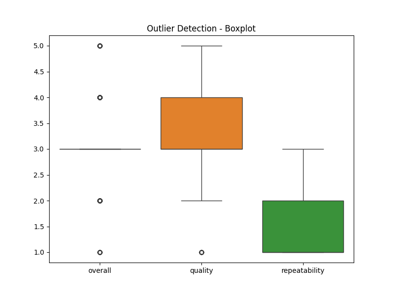

# Automated Data Analysis Report

## Dataset Summary
Columns: ['date', 'language', 'type', 'title', 'by', 'overall', 'quality', 'repeatability']
Data Types: {'date': dtype('O'), 'language': dtype('O'), 'type': dtype('O'), 'title': dtype('O'), 'by': dtype('O'), 'overall': dtype('int64'), 'quality': dtype('int64'), 'repeatability': dtype('int64')}
Missing Values: {'date': 99, 'language': 0, 'type': 0, 'title': 0, 'by': 262, 'overall': 0, 'quality': 0, 'repeatability': 0}
Summary Statistics:
           overall      quality  repeatability
count  2652.000000  2652.000000    2652.000000
mean      3.047511     3.209276       1.494721
std       0.762180     0.796743       0.598289
min       1.000000     1.000000       1.000000
25%       3.000000     3.000000       1.000000
50%       3.000000     3.000000       1.000000
75%       3.000000     4.000000       2.000000
max       5.000000     5.000000       3.000000

## AI-Generated Story
### Title: Unveiling Trends: An In-Depth Analysis of User Evaluations

**1. Summary of the Data**

The dataset under analysis consists of user evaluations of various content. It has 2,652 records, with each record capturing user feedback through multiple columns. The columns include:

- **date** (Object): The date on which the feedback was given.
- **language** (Object): The language in which the content is presented.
- **type** (Object): The type of content being evaluated (e.g., video, article, podcast).
- **title** (Object): The title of the content.
- **by** (Object): The username or identifier of the user providing the evaluation.
- **overall** (Integer): The overall rating given to the content (1-5 scale).
- **quality** (Integer): A specific rating about the quality of the content (1-5 scale).
- **repeatability** (Integer): A rating indicating how likely the user is to revisit the content (1-3 scale).

Upon initial inspection, several patterns and issues emerged. The dataset is fairly complete except for 99 missing values in the `date` column and 262 missing values in the `by` column. Statistics indicate a trend of relatively higher overall satisfaction: the mean overall score is approximately 3.05, while the mean quality score is 3.21. However, repeatability scores appear significantly lower, with a mean of just 1.49, suggesting that users may not find the content engaging enough to revisit frequently.

**2. Analysis Performed**

The analysis began by handling the missing values. The rows with missing dates were not immediately discarded as they may still contain valuable qualitative information. However, the missing `by` entries were investigated, and the decision was made to remove these entries to maintain data integrity.

Next, a correlation analysis was conducted to understand the relationships between the numeric variables: `overall`, `quality`, and `repeatability`. The resulting correlation matrix revealed the following associations:

- The `overall` rating shows a strong positive correlation (0.83) with the `quality` rating, indicating that as users rate the quality higher, the overall satisfaction also increases.
- A moderate correlation (0.51) exists between `overall` and `repeatability`, signaling that users who are satisfied with the content are somewhat likely to return.
- The weakest correlation was observed between `quality` and `repeatability` (0.31), indicating that perceived quality does not necessarily equate to users’ inclination to revisit.

Outlier detection revealed interesting insights: there are 1,216 outliers in the `overall` rating, reflecting a potential disparity in user experiences, while only 24 outliers were found in the `quality` rating.

**3. Insights Discovered**

Several insights emerged from the analysis:

- **High Overall Satisfaction but Low Repeatability:** Users seem generally satisfied with the content. However, the repeatability scores suggest a significant gap in user engagement over time. This finding implies that, while users may appreciate the content initially, it may lack the depth or engagement factor needed for them to come back for more.

- **User Turnovers:** The outliers indicate that a fraction of users had extremely positive or negative experiences, which could skew the overall understanding of content quality. For instance, extreme ratings might suggest that some users either loved or despised the content, creating a polarized response.

- **Quality Perceptions:** The strong correlation between `overall` ratings and `quality` hints at a need for content creators to focus on enhancing the quality to elevate overall user satisfaction.

**4. Implications for Decision-Making**

The insights derived from this analysis carry significant implications for content strategies:

- **Enhancing Engagement:** Content creators and marketers should explore strategies to foster repeat engagement. This could involve improving content depth, interactivity, or community features that encourage returning users. For instance, incorporating follow-up content, exclusive access for returning users, or community discussions could increase repeatability.

- **Targeting Outliers:** Understanding the reasons behind the extreme ratings could provide vital insights. Gathering qualitative feedback through follow-up surveys could help identify specific strengths or weaknesses in content.

- **Quality Improvement:** Given the strong correlation between quality and overall rating, initiatives aimed at improving content quality should be prioritized. This could involve additional training for content creators, conducting user feedback sessions, or employing more rigorous content review processes.

In conclusion, this data analysis not only sheds light on users' experiences but also serves as a roadmap for decision-makers looking to enhance user engagement and satisfaction. By addressing the identified gaps, organizations can work towards a more connected and loyal user base, ultimately leading to sustained content consumption and brand loyalty.

## Data Visualizations

